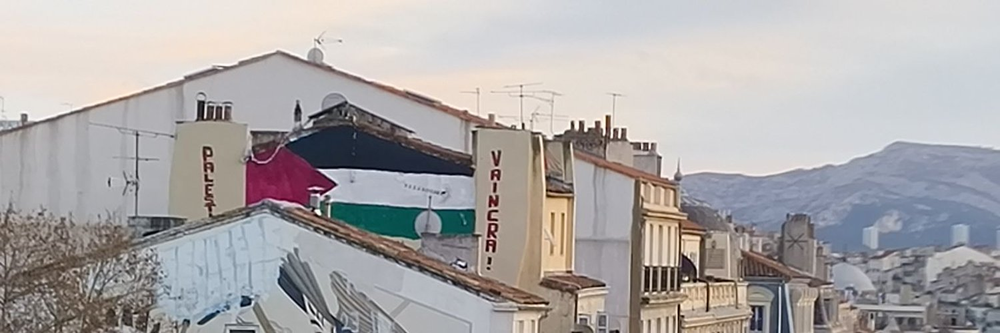

<div align="center">
  
</div>


# About Ivy 🏂 : 
```json
{
  "🌸 discord" : "1sheol", 
  "📚 age" : "16",
  "🏴 country" : "France"
  "🪐 currentlyLearing" : "GoLang (.go)",
}
``` 

## **💕Cutie Counter**
<a href="https://discord.com/users/921126770340683886"></a>
<a href="https://github.com/ivy-js"></a>

```yaml
Jvous vois ceux qui visitent :^)

Hehe~ another cutie has been caught.
Thx to all visitors
```


<a href="https://discord.com/users/1114616280138395738"></a>


<h3 align="left">Languages and Tools:</h3>
<p align="left"> <a href="https://www.w3schools.com/css/" target="_blank" rel="noreferrer">  </a> <a href="https://www.figma.com/" target="_blank" rel="noreferrer">  </a> <a href="https://git-scm.com/" target="_blank" rel="noreferrer">  </a> <a href="https://golang.org" target="_blank" rel="noreferrer">  </a> <a href="https://www.w3.org/html/" target="_blank" rel="noreferrer">  </a> <a href="https://www.java.com" target="_blank" rel="noreferrer">  </a> <a href="https://developer.mozilla.org/en-US/docs/Web/JavaScript" target="_blank" rel="noreferrer">  </a> <a href="https://www.linux.org/" target="_blank" rel="noreferrer">  </a> <a href="https://www.mongodb.com/" target="_blank" rel="noreferrer">  </a> <a href="https://www.mysql.com/" target="_blank" rel="noreferrer">  </a> <a href="https://nodejs.org" target="_blank" rel="noreferrer">  </a> <a href="https://www.python.org" target="_blank" rel="noreferrer">  </a> <a href="https://www.typescriptlang.org/" target="_blank" rel="noreferrer">

```
About Ivy-JS
Développeur Fullstack | Linux Enthusiast | Automatisation

Passionné par le développement et l’optimisation des workflows, je conçois des solutions efficaces et modulaires en JavaScript et Python. J’ai une forte appétence pour l’automatisation, le développement d’API et l’intégration de services, notamment dans l’écosystème Discord et les plateformes musicales.

Utilisateur de Linux, j’optimise mes environnements de travail avec Hyprland et un setup ricing personnalisé. Mon approche repose sur l’amélioration continue et la recherche constante de performance, tant sur le plan technique que personnel.

Actuellement, je travaille sur des projets mêlant bots Discord, API et automatisation, tout en explorant de nouvelles technologies pour affiner mon expertise.
Je travaille également sur @Songs.me, un projet futur autour du monde de la musique... 
```

